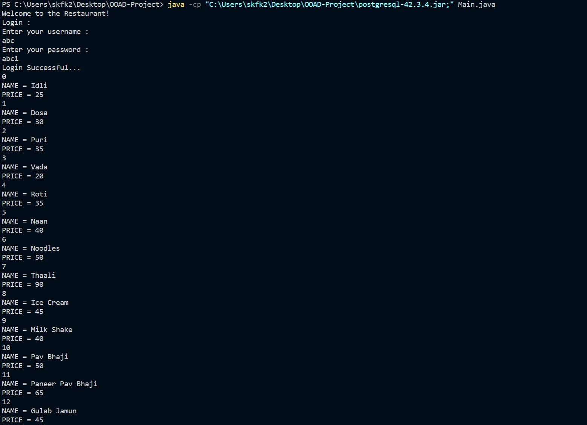
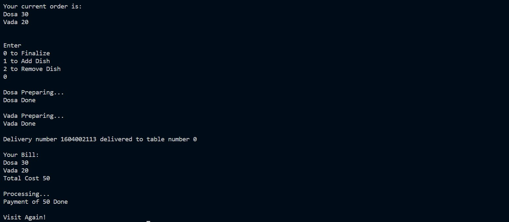

# Restaurant Management

***Team ID: C4*** \
*Eshan Deb* | *Faraaz Khan* | *Sai Manoj* \
This is a Restaurant Management System implemented using Java. It uses a PostgreSQL database.
The features of the application include:
  * User Login
  * Handling Simultaneous Users
  * Table Management
  * Billing of the ordered food items

## To Run
*$ javac Main.java* \
*$ java -cp "<PATH_TO_DRIVER>\postgresql-42.3.4.jar;" Main.java*

## Dependencies
* JDK Version 15 or above
* PostgresQL installed and integrated with the java program (ref: https://www.tutorialspoint.com/postgresql/postgresql_java.htm)

## Output Screenshots

